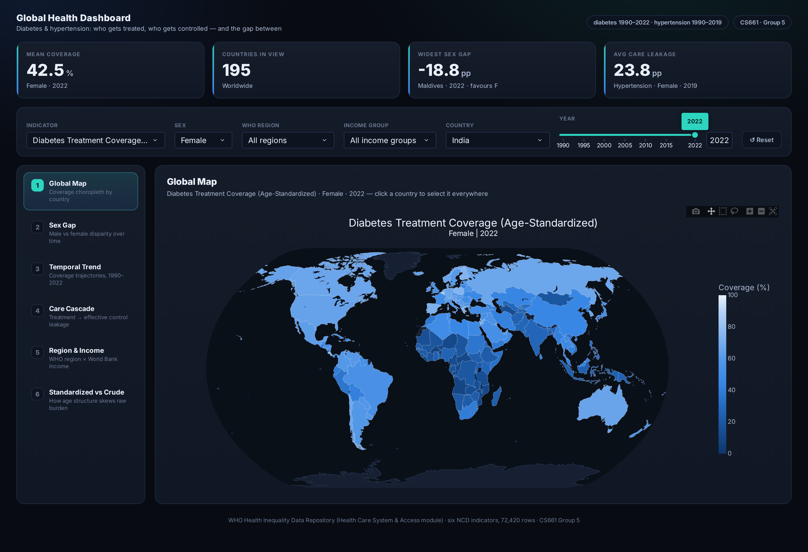

# Global Inequality in Diabetes and Hypertension Care
### A Visual Analytics Study

**CS661 — Big Data Visual Analytics · Group 5 · IIT Kanpur**

**🔗 Live dashboard: [global-health-dashboard-1.onrender.com](https://global-health-dashboard-1.onrender.com/)**
 · 📄 [Project report (PDF)](report/CS661_Group5_Project_Report.pdf)

An interactive visual analytics system for exploring three decades of global
inequality in chronic disease care. It asks one question from six linked angles:
**where in the world are people being treated for diabetes and hypertension but not
having it effectively controlled — and how has that gap evolved and differed by sex,
region, and income level?**



---

## Why this question

Managing diabetes and hypertension well depends on a health system doing two things
reliably: **reaching** people with treatment, and then **keeping their condition under
control**. These are not the same achievement. A country can put a large share of its
hypertensive population on medication and still fail to bring most of them to a
controlled blood pressure — and the difference between those two numbers is one of the
most policy-relevant quantities in chronic disease care.

The WHO publishes both figures, for the same country, year, and sex. That coincidence
is what makes this analysis possible.

## The data

Source: **WHO Health Inequality Data Repository** (Health Care System and Access module),
via the WHO Global Health Observatory.

The full repository holds 33 indicators, but most are too sparse to support a
country-comparative dashboard — many cover only a handful of countries per year, or
have no national-level values at all. We audited every indicator for completeness
before writing any visualization code, and scoped the project to the six that are
**verified complete**:

| Indicator | Countries | Years | Missing |
|---|---|---|---|
| Diabetes treatment coverage (age-standardized / crude) | 195 | 1990–2022 | 0 |
| Hypertension treatment coverage (age-standardized) | 195 | 1990–2019 | 0 |
| Hypertension treatment coverage (crude) | 194 | 1990–2019 | 0 |
| Hypertension effective control (age-standardized) | 195 | 1990–2019 | 0 |
| Hypertension effective control (crude) | 194 | 1990–2019 | 0 |

**72,420 country–year–sex estimates, zero missing values.** Every view in the dashboard
is backed by real data for every country and year in range — no chart is drawn on top
of a gap. Each estimate carries a sex breakdown, a WHO region, and a World Bank income
group.

## The six views

| # | View | What it answers |
|---|---|---|
| 1 | **Global Coverage Map** | Where is coverage highest and lowest? (choropleth, 195 countries, animated across three decades) |
| 2 | **Sex Gap Analysis** | How large is the male–female gap, and is it closing? (dumbbell chart across all years) |
| 3 | **Temporal Trend** | Has progress been equitably shared? (multi-line trends by country, WHO region, or income group) |
| 4 | **Treatment-to-Control Cascade** | Of the people a system treats, how many does it actually help? (the "leaky pipeline") |
| 5 | **Region × Income Comparison** | Is coverage explained by *where* a country is, or *how rich* it is? (grouped bars with error bars) |
| 6 | **Age-Standardized vs. Crude** | How much of a country's raw figure is just its age structure? (paired slope chart) |

## Key findings

- **Care is stratified, not merely uneven.** Diabetes treatment coverage runs from
  **8.5% in Burkina Faso to 86.0% in Belgium** — a 10× ratio — and the ordering of
  income groups is stable across every indicator.

- **Thirty years of universal progress have widened every absolute gap.** The
  high-income-to-low-income gap in hypertension control grew from **4.4 pp in 1990 to
  18.5 pp in 2019**, *even though* low-income countries improved by over 400% in
  relative terms. Growth rates converged; levels diverged. Percentage growth is a
  flattering and misleading measure of progress in global health.

- **Treatment is the easy half.** Globally, **fewer than half (47.5%) of treated
  hypertensive patients reach effective control.** The worst conversion rates belong not
  to the poorest countries but to **upper-middle-income** ones (43.7%) — systems that
  scaled up prescribing without scaling up follow-up.

- **Men are systematically under-reached.** Women have higher hypertension treatment
  coverage in **190 of 195 countries**, and the gap has *widened* since 1990 — the
  signature of a diagnostic rather than a therapeutic failure.

- **Measurement is a policy choice.** Choosing crude over age-standardized rates moves
  **Qatar 54 places** in a global ranking, and Japan 28 places the other way, purely
  because of population age structure.

The full analysis is in the [report](report/CS661_Group5_Project_Report.pdf).

## How the dashboard works

It is a **single-page, linked** dashboard, not a set of independent charts.

- **One source of truth.** All six views read from a single `dcc.Store` holding six
  fields — indicator, sex, WHO region, income group, country, and year. A single reducer
  callback owns it.
- **Cross-filtering.** Clicking a country on the map selects it everywhere; clicking a
  region×income bar sets the scope; clicking a point on a trend line sets the year.
- **Scoping.** Region and income narrow the pool of countries every other view considers;
  the country selection follows automatically rather than leaving the dashboard in an
  impossible state.
- **Nearest-year fallback.** Diabetes data runs to 2022 but hypertension only to 2019,
  so switching indicators at 2022 would otherwise blank the view. Instead it snaps to the
  nearest available year and says so.
- **Live KPI strip.** Four headline numbers recomputed from the current scope.

**Separation of concerns:** `visualizations/` holds six *pure* functions
(`DataFrame → Figure`) that know nothing about Dash; `app.py` supplies the shared state,
cross-filter logic, theming, caching, and layout on top of them.

**Accessibility:** the categorical palette is colour-blind-safe (worst adjacent pair
separates by ΔE 24.2 under protanopia, well clear of the ≥12 threshold) and was validated
against the chart surface rather than chosen by eye. Every multi-series chart carries a
legend, so identity is never conveyed by colour alone.

## Tech stack

**Python** · **Dash 4.4** (Flask) · **Plotly 6.9** · **pandas 3.0** · **NumPy 2.5**
Deployed on **Render**.

## Repository structure

```
app.py                  the dashboard — shared state, cross-filtering, theming, layout
visualizations/         the six pure chart functions (DataFrame → Figure)
data/                   eight prepared analytical tables (CSV)
report/                 project report (PDF), its source, and figures
old_code/               earlier UI iterations, kept for reference
```

## Running locally

```bash
pip install -r requirements.txt
python app.py
```

Then open <http://127.0.0.1:8050/>. The port can be overridden with the `PORT`
environment variable.

## Team — Group 5

| Component | Member | Roll No. |
|---|---|---|
| Data Preprocessing | Stuti Singh | 251083 |
| Task 1: Global Coverage Map | Annadevara Yashvanth Chary | 240143 |
| Task 2: Sex Gap Analysis | Singampalli Sri Varshith | 251110074 |
| Task 3: Temporal Trend Analysis | Mavilla Bharadwaja | 251110021 |
| Task 4: Treatment-to-Control Cascade | Talakola Maha Lakshmi<br>Khasha Meganakshtra | 241082<br>240542 |
| Task 5: Regional and Income-Group Comparison | Pyna Hema Lakshmi SatyaSree<br>Sruja BG | 240819<br>240289 |
| Task 6: Age-Standardized vs. Crude Rate Comparison | Unnati Gangurde | 231107 |

## Data source

World Health Organization — *Health Inequality Data Repository, Health Care System and
Access module*, WHO Global Health Observatory:
<https://www.who.int/data/inequality-monitor>
